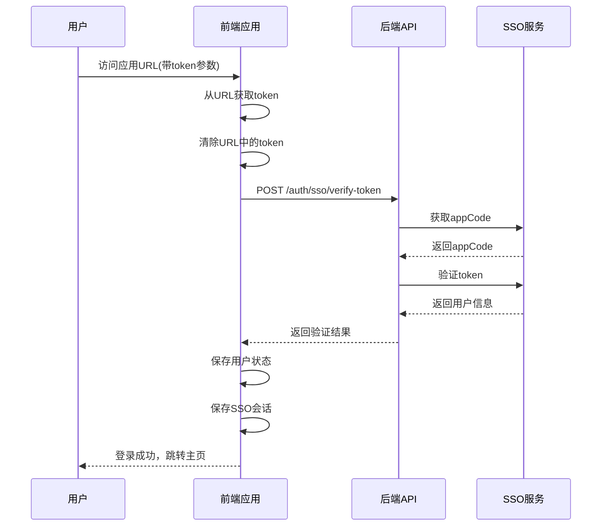
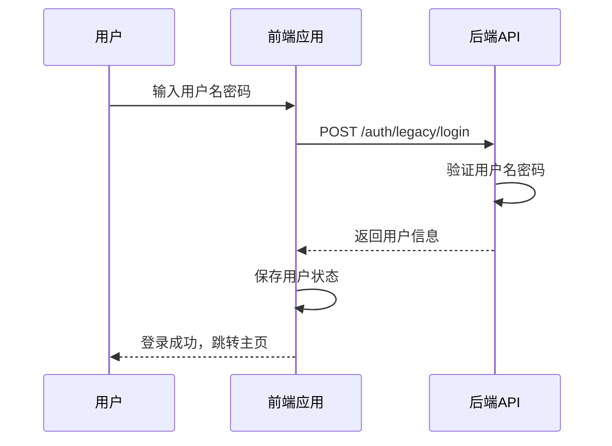

# SSO单点登录系统代码总结

## 📋 概述

本文档总结了项目中实现的SSO（Single Sign-On）单点登录系统的完整代码结构和功能。该系统基于中海油内部SSO服务，支持token验证、用户信息获取，并提供传统登录作为备用方案。

## 🏗️ 系统架构

```
SSO登录系统
├── 后端服务
│   ├── SSO服务类 (sso_service.py)
│   └── API路由 (system_routes.py)
├── 前端组件
│   ├── SSO工具类 (sso.js)
│   ├── 用户状态管理 (user.js)
│   └── API服务 (api.js)
└── 登录流程
    ├── URL Token获取
    ├── Token验证
    ├── 用户信息设置
    └── 会话管理
```

## 🔧 核心文件详解

### 1. 后端SSO服务核心 - `backend/app/services/sso_service.py`

#### 类结构定义
```python
class SSOService:
    """中海油单点登录服务类"""
    
    def __init__(self):
        # 中海油SSO配置
        self.base_url = "http://10.77.78.162/apigateway"
        self.app_name = "DApi"
        self.app_id = "880CADF172AC4ABD8864440804EE216F"
        self.api_token = "BVXUPHSWDEHIIQMU"
        
        # appCode缓存（有效期2小时）
        self._app_code = None
        self._app_code_expire_time = None
```

#### 核心方法

**1. 获取应用授权码**
```python
def get_app_code(self):
    """获取appCode，带缓存机制"""
    try:
        # 检查缓存是否有效
        if (self._app_code and self._app_code_expire_time and 
            datetime.now() < self._app_code_expire_time):
            print(f"使用缓存的appCode: {self._app_code}")
            return self._app_code
        
        # 获取新的appCode
        timestamp = self.get_timestamp()
        url = f"{self.base_url}/appauth/getappid"
        
        params = {
            "appName": self.app_name,
            "appId": self.app_id,
            "timeStamp": timestamp
        }
        
        response = requests.get(url, params=params, timeout=10)
        
        if response.status_code == 200:
            app_code = response.text.strip()
            
            # 缓存appCode（有效期2小时）
            self._app_code = app_code
            self._app_code_expire_time = datetime.now() + timedelta(hours=2)
            
            return app_code
```

**2. Token验证核心逻辑**
```python
def verify_token(self, token):
    """验证token并获取用户信息"""
    try:
        if not token:
            return {"success": False, "error": "Token不能为空"}
        
        # 获取appCode
        app_code = self.get_app_code()
        if not app_code:
            return {"success": False, "error": "获取appCode失败"}
        
        # 构造token验证请求
        url = f"{self.base_url}/zhySdk/tokenCheck"
        
        # 构造query参数并进行URL编码
        query_data = {
            "jsonObj": {
                "token": token
            }
        }
        
        # URL编码query参数
        query_json = json.dumps(query_data, ensure_ascii=False, separators=(',', ':'))
        query_encoded = urllib.parse.quote(query_json)
        
        params = {
            "appCode": app_code,
            "query": query_encoded
        }
        
        headers = {
            "apiToken": self.api_token
        }
        
        # 发送验证请求
        full_url = f"{url}?appCode={app_code}&query={query_encoded}"
        response = requests.get(full_url, headers=headers, timeout=10)
        
        if response.status_code == 200:
            result = response.json()
            
            # 简化校验：只要有响应数据就认为成功
            if result and result.get('data'):
                user_data = result.get('data', {})
                user_info = self._extract_user_info_simple(user_data, token)
                
                return {
                    "success": True,
                    "user": user_info,
                    "message": "Token验证成功"
                }
            else:
                error_msg = result.get('msg', '未知错误')
                return {
                    "success": False,
                    "error": f"Token验证失败: {error_msg}"
                }
```

**3. 用户信息提取**
```python
def _extract_user_info_simple(self, user_data, token):
    """简化的用户信息提取（保护隐私）"""
    user_info = {
        "id": user_data.get("userid", "unknown"),
        "username": user_data.get("username", "user"),
        "name": user_data.get("ryxm", "用户"),
        "role": "user",  # 默认角色
        "avatar": "",
        "email": "",
        "department": user_data.get("bmmc", ""),
        "phone": user_data.get("lxdh", ""),
        "token": token,
        "loginType": "sso"
    }
    
    return user_info
```

### 2. 后端API路由 - `backend/app/routes/system_routes.py`

#### SSO相关API接口

**1. Token验证接口**
```python
@bp.route('/auth/sso/verify-token', methods=['POST'])
def verify_sso_token():
    """验证SSO token并获取用户信息"""
    try:
        data = request.get_json()
        token = data.get('token')
        
        if not token:
            return jsonify({
                'success': False,
                'error': 'Token不能为空'
            }), 400
        
        print(f"收到SSO token验证请求: token={token}")
        
        # 调用SSO服务验证token
        result = sso_service.verify_token(token)
        
        if result['success']:
            return jsonify({
                'success': True,
                'data': result['user'],
                'message': result['message']
            })
        else:
            return jsonify({
                'success': False,
                'error': result['error']
            }), 401
            
    except Exception as e:
        print(f"SSO token验证异常: {str(e)}")
        return jsonify({
            'success': False,
            'error': f'Token验证异常: {str(e)}'
        }), 500
```

**2. 传统登录接口（备用方案）**
```python
@bp.route('/auth/legacy/login', methods=['POST'])
def legacy_login():
    """传统登录方式（用户名密码），作为SSO的备用方案"""
    try:
        data = request.get_json()
        username = data.get('username')
        password = data.get('password')
        
        if not username or not password:
            return jsonify({
                'success': False,
                'error': '用户名和密码不能为空'
            }), 400
        
        # 简单的用户名密码验证
        if username == 'admin' and password == 'Admin123':
            user_info = {
                "id": 1,
                "username": username,
                "name": "系统管理员",
                "role": "admin",
                "avatar": "",
                "email": "admin@system.com",
                "department": "系统管理部",
                "phone": "",
                "loginType": "legacy"
            }
            
            return jsonify({
                'success': True,
                'data': user_info,
                'message': '登录成功'
            })
        else:
            return jsonify({
                'success': False,
                'error': '用户名或密码错误'
            }), 401
```

**3. 其他辅助接口**
```python
# 刷新appCode接口
@bp.route('/auth/sso/refresh-appcode', methods=['POST'])
def refresh_sso_appcode():
    """刷新SSO appCode（用于调试和故障排除）"""

# SSO连通性测试接口
@bp.route('/auth/sso/test', methods=['GET'])
def test_sso():
    """测试SSO服务连通性"""

# Token格式测试接口
@bp.route('/auth/sso/test-token-format', methods=['POST'])
def test_token_format():
    """测试token格式和编码"""
```

### 3. 前端SSO工具类 - `frontend/src/utils/sso.js`

#### URL参数处理
```javascript
/**
 * 从URL参数中获取token
 * @returns {string|null} token值或null
 */
export function getTokenFromUrl() {
  const urlParams = new URLSearchParams(window.location.search)
  
  // 根据需求，token参数名为 'token'
  const token = urlParams.get('token')
  
  if (token) {
    console.log(`从URL获取到token: ${token.substring(0, 30)}...`)
    return token
  }
  
  return null
}

/**
 * 清除URL中的token参数（避免token在URL中暴露）
 */
export function clearTokenFromUrl() {
  const url = new URL(window.location.href)
  const params = url.searchParams
  
  if (params.has('token')) {
    params.delete('token')
    const newUrl = url.pathname + (params.toString() ? '?' + params.toString() : '') + url.hash
    window.history.replaceState({}, '', newUrl)
    console.log('已清除URL中的token参数')
  }
}
```

#### 会话管理
```javascript
/**
 * 保存SSO登录状态到本地存储
 * @param {object} userInfo 用户信息
 */
export function saveSSOSession(userInfo) {
  sessionStorage.setItem('ssoLogin', 'true')
  sessionStorage.setItem('ssoUserInfo', JSON.stringify(userInfo))
  sessionStorage.setItem('isLoggedIn', 'true')
  sessionStorage.setItem('userInfo', JSON.stringify(userInfo))
  
  console.log('SSO会话已保存')
}

/**
 * 清除SSO登录状态
 */
export function clearSSOSession() {
  sessionStorage.removeItem('ssoLogin')
  sessionStorage.removeItem('ssoUserInfo')
  sessionStorage.removeItem('isLoggedIn')
  sessionStorage.removeItem('userInfo')
  localStorage.removeItem('rememberedUser')
  
  console.log('SSO会话已清除')
}

/**
 * 检查是否是SSO登录状态
 * @returns {boolean}
 */
export function isSSOLoggedIn() {
  return sessionStorage.getItem('ssoLogin') === 'true'
}
```

#### 用户信息格式化
```javascript
/**
 * 格式化用户信息
 * @param {object} userInfo 原始用户信息
 * @returns {object} 格式化后的用户信息
 */
export function formatUserInfo(userInfo) {
  return {
    id: userInfo.id || 'unknown',
    username: userInfo.username || 'unknown',
    name: userInfo.name || userInfo.displayName || userInfo.realName || '未知用户',
    role: userInfo.role || 'user',
    avatar: userInfo.avatar || '',
    email: userInfo.email || '',
    department: userInfo.department || '',
    phone: userInfo.phone || '',
    loginType: userInfo.loginType || 'sso',
    token: userInfo.token || '',
    originalData: userInfo.originalData || null
  }
}
```

### 4. 前端状态管理 - `frontend/src/stores/user.js`

#### Store状态定义
```javascript
export const useUserStore = defineStore('user', {
  state: () => ({
    // 用户信息
    user: null,
    // 登录状态
    isLoggedIn: false,
    // 记住我状态
    rememberMe: false,
    // SSO登录状态
    isSSOLogin: false,
    // 登录加载状态
    loginLoading: false
  })
})
```

#### SSO登录处理
```javascript
// SSO token登录
async ssoLogin(token) {
  try {
    this.loginLoading = true
    console.log('开始SSO token验证...')
    
    const response = await apiService.auth.verifySSOToken(token)
    
    if (response.data && response.data.success) {
      const userInfo = formatUserInfo(response.data.data)
      
      // 设置用户信息
      this.setUser(userInfo)
      this.setLoginStatus(true)
      this.isSSOLogin = true
      
      // 保存SSO会话
      saveSSOSession(userInfo)
      
      console.log('SSO登录成功:', userInfo)
      return { success: true, user: userInfo }
    } else {
      const errorMsg = response.data?.error || 'Token验证失败'
      console.error('SSO验证失败:', errorMsg)
      return { success: false, error: errorMsg }
    }
  } catch (error) {
    console.error('SSO登录异常:', error)
    const errorMsg = error.response?.data?.error || error.message || 'SSO登录失败'
    return { success: false, error: errorMsg }
  } finally {
    this.loginLoading = false
  }
}
```

#### 状态初始化
```javascript
// 初始化登录状态（从sessionStorage恢复）
initAuthState() {
  const isLoggedIn = sessionStorage.getItem('isLoggedIn') === 'true'
  const userInfo = sessionStorage.getItem('userInfo')
  const isSSOLogin = isSSOLoggedIn()
  
  if (isLoggedIn && userInfo) {
    try {
      this.user = JSON.parse(userInfo)
      this.isLoggedIn = true
      this.isSSOLogin = isSSOLogin
      
      console.log('恢复登录状态:', {
        username: this.user.username,
        loginType: this.user.loginType,
        isSSOLogin: this.isSSOLogin
      })
    } catch (error) {
      console.error('恢复用户信息失败:', error)
      this.logout()
    }
  }
}
```

### 5. 前端API服务 - `frontend/src/utils/api.js`

#### API接口定义
```javascript
// 认证相关API
auth: {
  // SSO token验证
  verifySSOToken: (token) => api.post('/api/auth/sso/verify-token', { token }),
  
  // 传统登录
  legacyLogin: (username, password) => api.post('/api/auth/legacy/login', { username, password }),
  
  // 刷新appCode（调试用）
  refreshAppCode: () => api.post('/api/auth/sso/refresh-appcode'),
  
  // 测试SSO连通性
  testSSO: () => api.get('/api/auth/sso/test')
}
```

## 🔄 完整登录流程

### SSO登录流程


### 传统登录流程


## 🛡️ 安全特性

### 1. Token处理安全
- **URL清理**：登录后立即从URL中删除token参数，防止token泄露
- **会话隔离**：使用sessionStorage存储临时会话，页面关闭后自动清除
- **Token验证**：每次请求都通过后端验证token有效性

### 2. 缓存机制
- **appCode缓存**：带2小时有效期，减少对SSO服务的频繁请求
- **用户信息缓存**：在会话期间缓存用户信息，提升用户体验

### 3. 错误处理
- **完善的异常捕获**：各层都有完整的try-catch处理
- **详细的错误日志**：便于问题排查和调试
- **用户友好的错误提示**：向用户展示清晰的错误信息

### 4. 备用方案
- **传统登录**：当SSO服务不可用时，提供用户名密码登录
- **状态恢复**：应用重新加载时自动恢复登录状态

## 📝 配置信息

### SSO服务配置
```python
# 中海油SSO服务配置
base_url = "http://10.77.78.162/apigateway"
app_name = "DApi"
app_id = "880CADF172AC4ABD8864440804EE216F"
api_token = "BVXUPHSWDEHIIQMU"
```

### API端点配置
```javascript
// 后端API服务器配置
const SERVER_IP = '10.77.76.232'
const API_PORT = 5000
```

## 🧪 测试和调试

### 1. SSO连通性测试
```bash
GET /api/auth/sso/test
```

### 2. Token格式测试
```bash
POST /api/auth/sso/test-token-format
{
  "token": "your_test_token"
}
```

### 3. 刷新appCode
```bash
POST /api/auth/sso/refresh-appcode
```

## 🔍 常见问题排查

### 1. Token验证失败
- 检查token格式和编码
- 验证appCode获取是否正常
- 确认SSO服务连通性

### 2. 用户信息获取异常
- 检查SSO服务返回的用户数据格式
- 确认必需字段是否存在
- 验证用户信息提取逻辑

### 3. 会话状态异常
- 检查sessionStorage中的数据
- 验证用户状态管理逻辑
- 确认登录状态恢复机制

## 📚 相关文件清单

### 后端文件
- `backend/app/services/sso_service.py` - SSO服务核心类
- `backend/app/routes/system_routes.py` - SSO API路由

### 前端文件
- `frontend/src/utils/sso.js` - SSO工具函数
- `frontend/src/stores/user.js` - 用户状态管理
- `frontend/src/utils/api.js` - API服务接口

---

*本文档最后更新时间：2024年9月28日*
